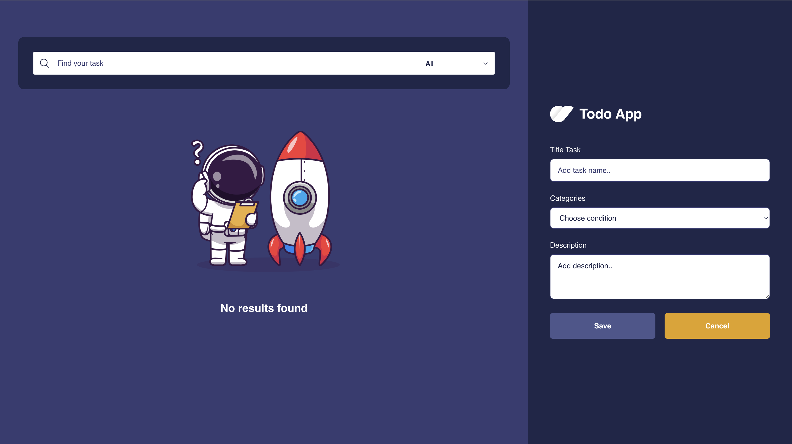
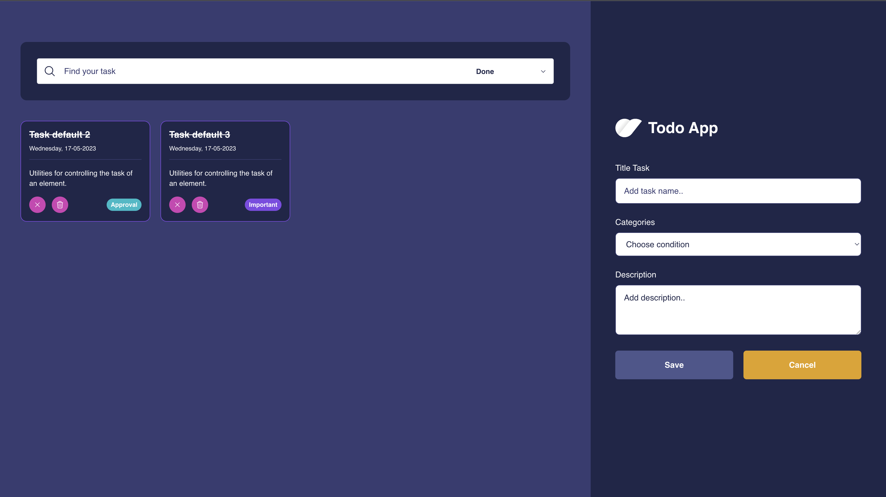
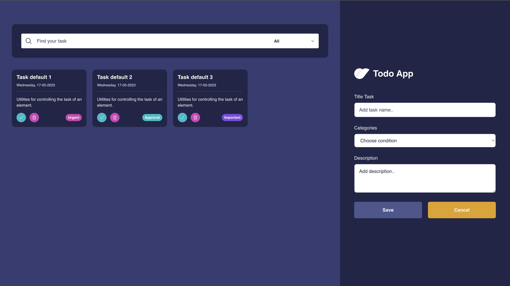

## 🔍 About

To do application is a web device built with VueJS - 3

## 🔧 Made With

- [Vue Js - 3] (https://vuejs.org/)
- [Vite] (https://vitejs.dev/)
- [Pinia] (https://pinia.vuejs.org/)
- [Typescript] (https://www.typescriptlang.org/)

## 🔌 Installation

Clone the repository to your machine:

`https://github.com/Rikoprim/TodoApp-Vue3`

After cloning the repository, open your terminal and run:

```
Git clone this project
Yarn install
Yarn dev
Running in port :8080
```

## 🏞 Screenshot

<p align="center">
  
</p>

<p align="center">
  
</p>

<p align="center">
  
</p>
